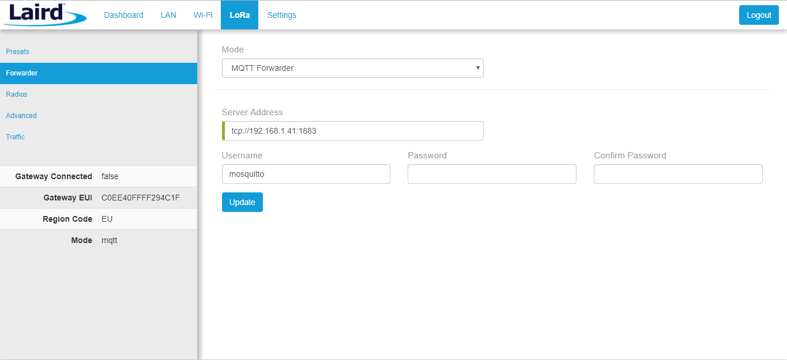

# Heatmap LoRa signal

Este proyecto se trata de un TFM, donde se obtiene como resultado un mapa de calor de la señal LoRa en cada punto geográfico.
El hardware necesario es una raspberry con una antena LoRa para poder enviar mediante LoRa un paquete con la posición geografica de cada instante, este paquete es recibido por un router LoRa que reenvía la señal mediante MQTT a un broker. El broker será leído por una aplicación en Nodejs que almacena los datos en una base de datos no relacional, MongoDB. Por último, otra aplicación Nodejs leerá la base de datos y generará el mapa de calor.


## Raspberry PI 3 B

Se intala en la Rasberry Pi un sistema operativo Raspbian con git para clonar el proyecto, una vez instalado se debe configurar la conexión con ssh. Para configurar la antena LoRA y el gps se deben seguir los siguientes pasos.

```#Editar el inicio de la Raspberry
sudo nano /boot/cmdline.txt
	dwc_otg.lpm_enable=0 console=tty1 root=/dev/mmcblk0p2 
	rootfstype=ext4 elevator=deadline rootwait
#Detenemos los servicios GPS por defecto de Rasberry PI
sudo systemctl stop serial-getty@ttyAMA0.service
sudo systemctl disable serial-getty@ttyAMA0.service
sudo shutdown -r now
#Se instala GPS para poder visualizar los resultados
sudo apt-get install gpsd gpsd-clients python-gps
#Paramos los socket de GPS ahora activos
sudo systemctl stop gpsd.socket
sudo systemctl disable gpsd.socket
#Se crea el nuevo socket GPS
sudo gpsd /dev/ttyAMA0 -F /var/run/gpsd.sock
#Se detiene para poder volverlo a lanzar
sudo killall gpsd
sudo gpsd /dev/ttyAMA0 -F /var/run/gpsd.sock
#Se definen nuevos parámetros para GPS (probar por defecto anteriormente)
sudo nano /etc/default/gpsd
	START_DAEMON="true"
	GPSD_OPTIONS="/dev/ttyAMA0"
	DEVICES=""
	USBAUTO="true"
	GPSD_SOCKET="/var/run/gpsd.sock"
#Lanzamos la librería para obtener los resultados
cgps -s
#Acceder al repositorio clonado y ejecutar
cd heat_lora_signal/cooking_hack/arduPi && chmod +x install_arduPi && ./install_arduPi && rm install_arduPi
cd heat_lora_signal/cooking_hack/examples/LoRaWAN && make send-packages-lora-gps
```

## Router LoRA

Para este ejemplo se ha utilizado un router Sentrius RG1xx.


Se configura el forwarding de LoRa añadiendo la IP donde esta el broker de MQTT.



Y ver el tráfico LoRa.


## Docker Compose

El resto de la aplicación se ha diseñado con Docker para facilitar la instalación. 
Se lanza con docker compose desde la raiz del proyecto. 

```
docker-compose build && docker-compose up
```

### Broker MQTT

En la carpeta broker-mqtt, mediante Docker se levanta un contenedor que genera un broker para MQTT.

### MongoDB

En la carpeta mongo, mediante Docker se levanta un contenedor que genera una base de datos no relacional, donde serán persistentes los datos recolectados.

### Subcriber MQTT in Nodejs

En la carpeta subscriber-mqtt, mediante Docker se levanta un contenedor que genera una aplicación suscrita al broker de MQTT, una vez recibidos los datos se encarga de limpiar datos erroneos y almacenar los datos en la base de datos.

### Interface MQTT in Nodejs

En la carpeta interface-nodejs, mediante Docker se levanta un contenedor que genera una interfaz gráfica donde se puede ver gráficamente los datos en un mapa de calor, por otro lado, se puede configurar los parámetros de la Raspberry a la hora de enviar la señal LoRa.

## Configure Raspberry with Ansible

La configuración de los parámetros LoRa se puede hacer desde la interfaz gráfica:


La aplicación se conecta mediante Ansible con la Raspberry PI, y cambia los parámetros de LoRa. Para la conexión en necesario configurar la clave ssh de la Raspberry.